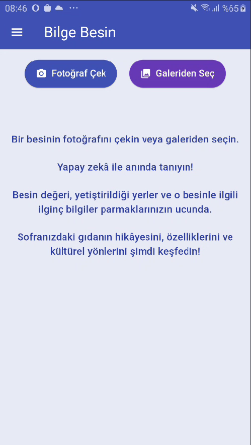
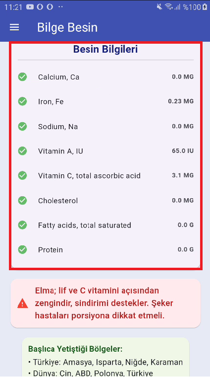
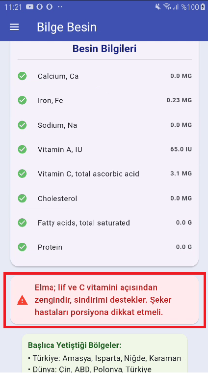
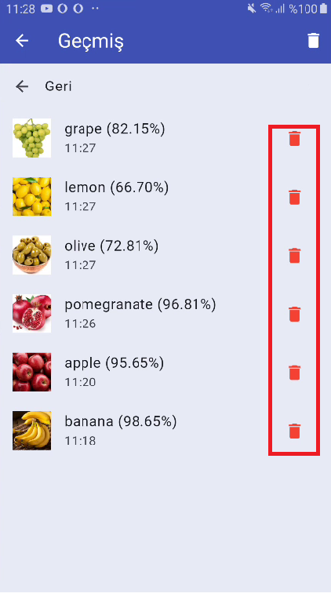
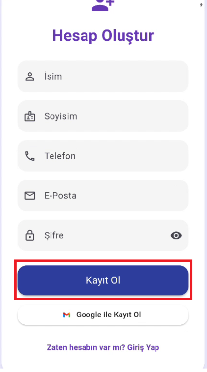
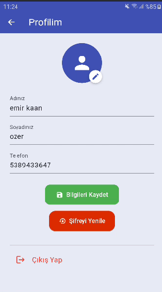
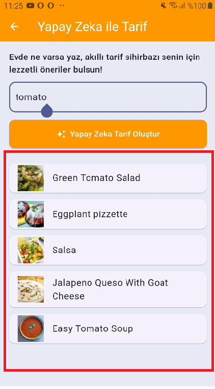
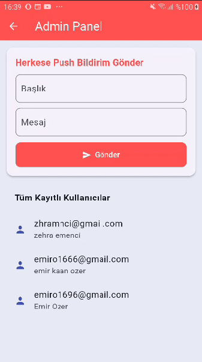

# 📱 Smart Food Recognition Application

Bu proje, yapay zeka destekli bir **gıda tanıma ve bilgi verme** uygulamasıdır.  
Flutter ile geliştirilmiş olup, **TensorFlow Lite**, **Firebase** ve **USDA API** teknolojilerini kullanmaktadır.  
Kullanıcılar meyve veya sebze fotoğrafı çekerek ya da galeriden seçerek besin hakkında anında bilgi alabilir.

---

## 🚀 Özellikler
- **📷 Gıda Tanıma:** Kamera veya galeriden yüklenen görselleri yapay zeka ile tanıma.
- **ℹ️ Besin Bilgileri:** USDA API üzerinden kalori, vitamin, mineral ve diğer besin değerleri.
- **📍 Yetiştiği Bölgeler:** Ürünün yetiştiği ülke ve şehir bilgileri.
- **💡 Bilgilendirici Notlar:** Sağlık ve beslenme önerileri.
- **🗑 Geçmiş Yönetimi:** Önceden tanınan besinleri listeleme ve silme.
- **👤 Kullanıcı Yönetimi:** Firebase Authentication ile kayıt, giriş ve profil düzenleme.
- **📢 Push Bildirim:** Admin panelinden tüm kullanıcılara bildirim gönderme.
- **🍳 Yapay Zeka ile Tarif:** Belirtilen malzemeye uygun yemek tarifleri önerme.

---

## 🛠 Kullanılan Teknolojiler
- **Flutter** (Mobil geliştirme)
- **Firebase Authentication & Firestore** (Kullanıcı girişi ve veri depolama)
- **Firebase Cloud Messaging** (Push bildirim)
- **TensorFlow Lite & OpenCV** (Görüntü işleme ve sınıflandırma)
- **USDA API** (Besin bilgileri)
- **Recipe API** (Tarif önerileri)

---

## 📸 Ekran Görselleri

### Ana Menü


### Besin Bilgileri


### Bilgilendirici Metin


### Geçmiş Ekranı


### Kayıt Ol Ekranı


### Profilim Ekranı


### Yapay Zeka ile Tarif


### Admin Panel



---

## 📂 Kurulum

1. Depoyu klonla:
   ```bash
   git clone https://github.com/emirkaanoze-r/smart-food-recognition-application.git
   ```
2. Proje dizinine gir:
   ```bash
   cd smart-food-recognition-application
   ```
3. Gerekli paketleri yükle:
   ```bash
   flutter pub get
   ```
4. Firebase yapılandırma dosyasını (`google-services.json`) `android/app` klasörüne ekle.
5. Uygulamayı başlat:
   ```bash
   flutter run
   ```

---

## 📜 Lisans
Bu proje MIT Lisansı ile lisanslanmıştır.
